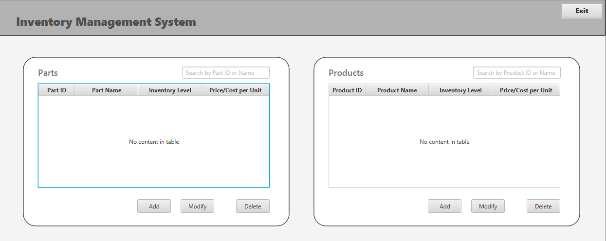
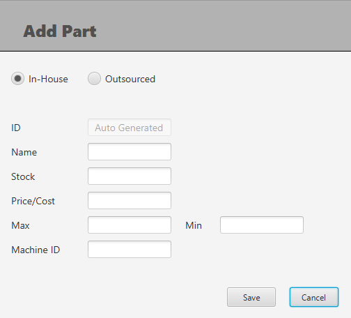
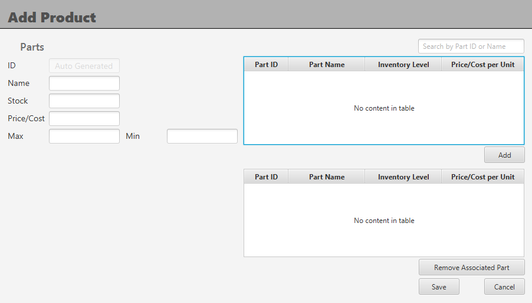
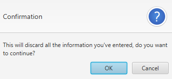
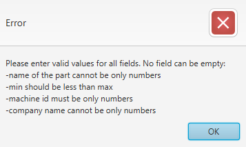

# Inventory

## Description

An international inventory management system that maintains lists of parts (made in-house and outsourced) and products with associated parts. The application provides functionality to add, modify, or delete part/product. 
Products can only be deleted when no parts are associated with it. main screen of the app includes two tables for parts and products, including a unique ID, item name, number 
of items in the inventory, and price per unit. It includes search functionality for the tables.

The application implements the MVC pattern using JavaFX. All changes to the parts and products are submitted after a user confirms the action through a confirmation window. 
Incorrect input handling has also been implemented by design and is as follows:
<ul>
  <li>Parts:</li>
    <ul>
      <li>Name cannot be only numbers.</li>
      <li>Minimum number of parts used cannot be larger than maximum.</li>
      <li>Stock must be a number.</li>
      <li>Price must be a number, the app doesn't allow other input than a number.</li>
      <li>Company name for outsourced parts cannot contain only numbers.</li>
    </ul>
  <li>Products</li>
      <ul>
        <li>Name cannot be only numbers.</li>
        <li>Minimum number of parts used cannot be larger than maximum.</li>
        <li>Price must be a number, the app doesn't allow other input than a number.</li>
      </ul>
</ul>

## GUI

Main menu window. It includes 2 main views - table of all parts and table of all products. Text fields in the right corners of each allow to filter that table by parts/products names. Each view allows to add/modify/delete an item from the associated table. 

Add/Update part window. It includes the type (In-House and Outsourced) of the part and other associated information to the item. All input is validated followed by an error message if it is invalid. Cancel button is followed by a confirmation window to verify the choice to discard the data.

Add/Update product window. It includes all product information and parts in a form of two tables: available parts and associated with the product parts. All input is validated followed by an error message if it is invalid. Cancel button is followed by a confirmation window to verify the choice to discard the data.

Confirmation window

Error window

## Requirements

<ul>
  <li>Java 11 or higher</li>
  <li>JavaFX 13 or higher</li>
</ul>

## Authors
Iulia Bejsovec
